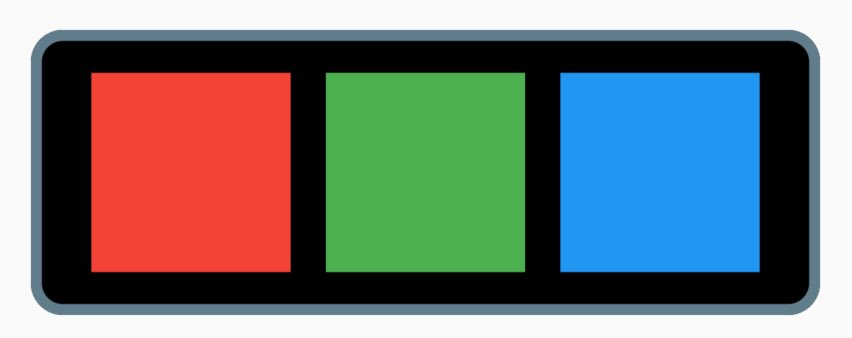

# Extended

`Extended` is a set of Flutter widgets that are extended based on Material and Cupertino widgets. The widgets of in this package have extra functionalities.
For instance, `Column` widget does column things only on Material widget. It does not have background color option, nor tap handler and often we need to add those functionality to `Column` widget. And this is the reason why we have `Extended` package here. `Extended` package also provide method like `alert`.


## Features

### Common properties

- All the extended widgets have as much as the common properties like below.
    - color, 
    - backgroundColor,
    - borderColor,
    - borderRadius,
    - margin,
    - padding,
    - size,
    - width,
    - height,
    - tap, 
    - long press,
    - double tap
    

- See the example codes and try to open the source file in the paackage. It will surely gives you an idea how the `Extended` widgets are built, and how to use.

## Getting started

Just add the package name and version into your pubspec.yaml

## Usage

### Boxes

- There are some box widget.
- `RedBox`, `GreenBox`, `BlueBox`

### TappableRow

- `TappableRow` has flex option.
  - `TappableRow(children: [ RedBox(), GreenBox(), BlueBox() ], flexes: [1,2,3])`




```dart
TappableRow(
  mainAxisAlignment: MainAxisAlignment.spaceAround,
  margin: const EdgeInsets.all(16),
  padding: const EdgeInsets.all(16),
  backgroundColor: Colors.black,
  borderRadius: 16,
  borderWidth: 5.5,
  borderColor: Colors.blueGrey,
  children: const [RedBox(), GreenBox(), BlueBox()],
  onTap: () => alert(context, 'onTap', 'tapped'),
  onDoubleTap: () => alert(context, 'onDoubleTap', 'double tapped'),
  onLongPress: () => alert(context, 'onLongPress', 'long press'),
),
```

## Additional information

TODO: Tell users more about the package: where to find more information, how to 
contribute to the package, how to file issues, what response they can expect 
from the package authors, and more.


## TODO list


- 